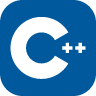
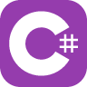
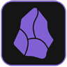
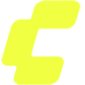
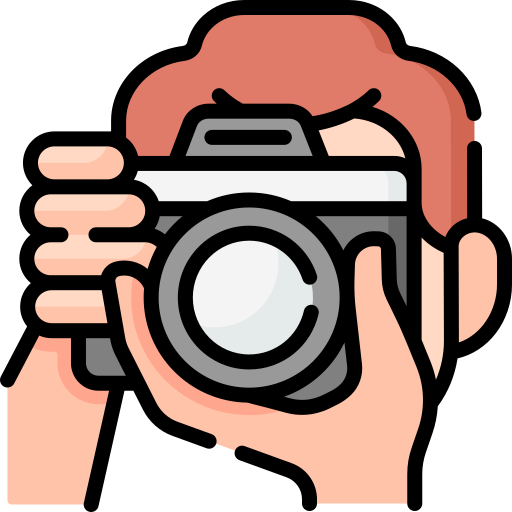

<h1 align="center">Markus Götz</h1>
<h3 align="center">Software Developer & Problemlöser</h3>

Hi, ich bin Markus – leidenschaftlicher Softwareentwickler mit Herz für strukturierten Code und smarte Prozesse.

<h1></h1>
<h3>Tech-Stack</h3>
<h4>SPRACHEN & FORMATE</h4>

 
  
  
  
  
  
  
  
  
  

<h4>WERKZEUGE & KI</h4>

 
  
  
  
  
  
  
  

<h4>KREATIVES & MEDIEN</h4>

 
  
  
  

<h1></h1>
<h3>Showcase</h3>
<a href="https://septem-sensu.de">septem-sensu.de - Weil Fotografieren Spaß macht</a>

  
  Eine Plattform und ein kreativer Raum rund um die Faszination der Porträt- und Studiofotografie. Neben technischen Aspekten wie Lichtgestaltung und Location-Auswahl liegt der Fokus hier auf dem Gespür für gelungene Bildkompositionen und dem Ausdruck von Emotionen durch die Linse. Ein echtes Herzensprojekt.
   

<i><small>Kreativ, leidenschaftlich, Fokus auf Licht & Komposition</small></i>

<small>● PHP ● JavaScript ● HTML ● CSS</small>

 
<a href="https://bloompro.de">bloompro.de - Dein digitales Grow-Journal</a>

  
  Ein durchdachtes und effizientes Journal-Tool zur Verwaltung und Protokollierung des eigenen Anbaus. Hilft Nutzern, jeden einzelnen Schritt der Pflanzenentwicklung lückenlos zu dokumentieren, um optimale Ergebnisse bei der Ernte zu erzielen. Smarte Datenstrukturierung trifft auf benutzerfreundliche Workflows.
   

<i><small>Strukturierendes Tool, lösungsorientiert, exakt dokumentiert</small></i>

<small>● PHP ● JavaScript ● HTML ● CSS</small>

<h1></h1>
<h3>Kontakt und Social Media</h3>

  
  
  
  
  

